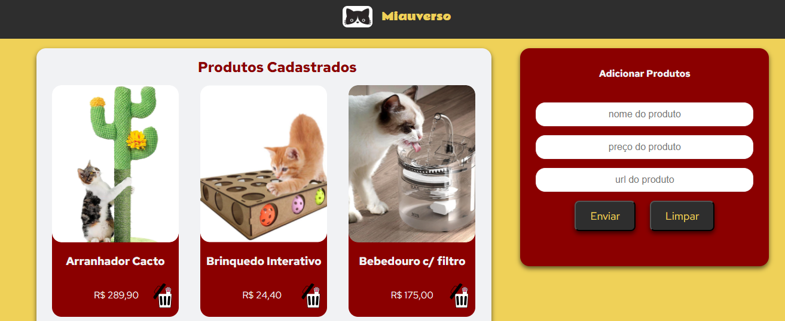

# Challenge ONE | Front End - AluraGeek

---

## 📋 Sobre o Projeto
O projeto foi desenvolvido no 3º Challenge do curso Especialização FrontEnd da Oracle Next Education em parceria com a Alura. 
O objetivo era desenvolver uma aplicação para listar, cadastrar e deletar produtos.

## 🎨 Layout
O design foi desenvolvido no Figma, onde modifiquei o tema e outros detalhes do que foi proposto.

## 🛠️ Tecnologias Utilizadas

## 👩‍💻 Desenvolvedora
Para saber mais sobre mim e meus projetos, visite meus perfis:
- [GitHub](https://github.com/tetsguitar)
- [LinkedIn](https://www.linkedin.com/mariaesther)
